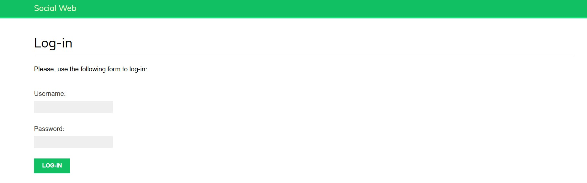

# SocialImage: Plataforma Red Social para Compartir Imágenes

SocialImage es una red social moderna centrada en la curación y el descubrimiento visual. La plataforma permite a los usuarios recopilar, organizar y compartir imágenes de cualquier lugar de internet, interactuar con otros creadores mediante un sistema de seguimiento dinámico y reaccionar al contenido en tiempo real.

---

## Roadmap General del Proyecto

El desarrollo de este ecosistema se ha planificado en fases incrementales:

- [🔄] **Fase 1: Sistema de Autenticación y Gestión de Perfiles** (En desarrollo)
- [ ] **Fase 2:** Autenticación Social (OAuth2 con Google) e Integración Frontend.
- [ ] **Fase 3:** Motor de Marcadores (Bookmarklet) para capturar imágenes externas vía JavaScript.
- [ ] **Fase 4:** Flujo de Actividad Dinámico (Activity Stream) y Sistema de Seguimiento (Following).

---

## Fase 1: Sistema de Autenticación y Gestión de Perfiles

Esta primera fase establece las bases de seguridad, persistencia de usuarios y manejo de archivos multimedia del proyecto.

### Funcionalidades Implementadas
- **Autenticación Base:** Integración del marco nativo de autenticación de Django para la verificación segura de identidades.
- **Formulario de Acceso:** Creación y configuración de la vista de inicio de sesión (Login) para la validación de credenciales de usuario.

### Decisiones de Arquitectura
*   **Vistas de Autenticación:** Utilización de las herramientas nativas de Django para el manejo seguro de sesiones HTTP, previniendo vulnerabilidades comunes de autenticación mediante el uso de formularios protegidos con tokens CSRF.

---

## Capturas de Pantalla / Demostración Visual

|               Interfaz de Login               | Perfil de Usuario |
|:---------------------------------------------:| :---: |
|  | [Pendiente - Fase 1.2] |

---

## Tecnologías y Herramientas
*   **Backend:** Python 3.14.0 +, Django 6.0.6
*   **Base de Datos:** SQLite (Desarrollo local preliminar)
*   **Estilos:** HTML5, CSS3

---

## Instalación y Configuración Local

### Prerrequisitos
*   Python 3.11 o superior instalado.
*   Gestor de entornos virtuales (venv).

### Pasos para Ejecutar
1. **Clonar el repositorio:**
   ```bash
   git clone https://github.com
   cd socialimage
   ```

2. **Crear y activar el entorno virtual:**
   ```bash
   python -m venv venv
   # En Windows:
   venv\Scripts\activate
   # En macOS/Linux:
   source venv/bin/activate
   ```

3. **Instalar dependencias:**
   ```bash
   pip install -r requirements.txt
   ```

4. **Ejecutar migraciones iniciales:**
   ```bash
   python manage.py migrate
   ```

5. **Iniciar el servidor de desarrollo:**
   ```bash
   python manage.py runserver
   ```
   Abre http://127.0.0.1:8000 en tu navegador.

---

## Bitácora de Desarrollo (Build Log)

Utilizo esta sección para documentar los desafíos técnicos superados y el progreso diario del proyecto.

### 08/07/2026 - Inicialización y Core de Autenticación
*   **Progreso:** Setup inicial de la arquitectura del proyecto en Django e implementación del flujo base de autenticación con la vista de Login.
*   **Tareas completadas:**
    *   Configuración del entorno virtual y dependencias base.
    *   Habilitación de la aplicación de autenticación en los ajustes de Django.
    *   Creación de la ruta y plantilla inicial para el formulario de inicio de sesión.

