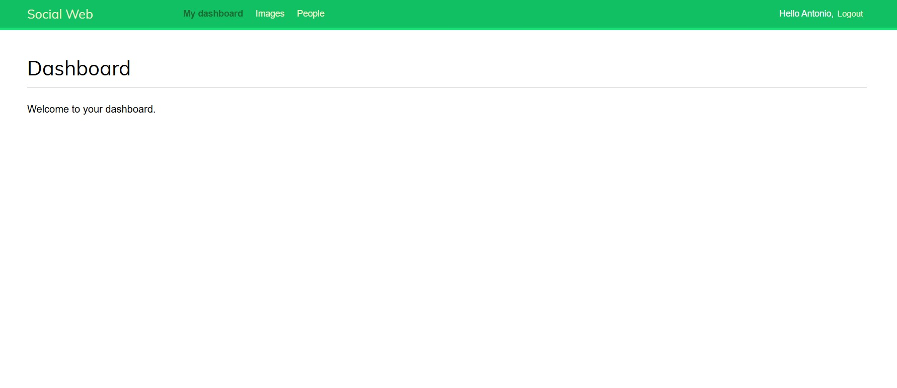
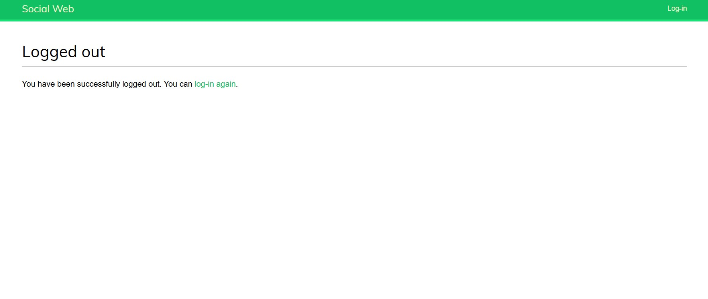
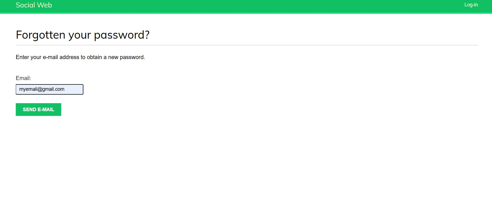
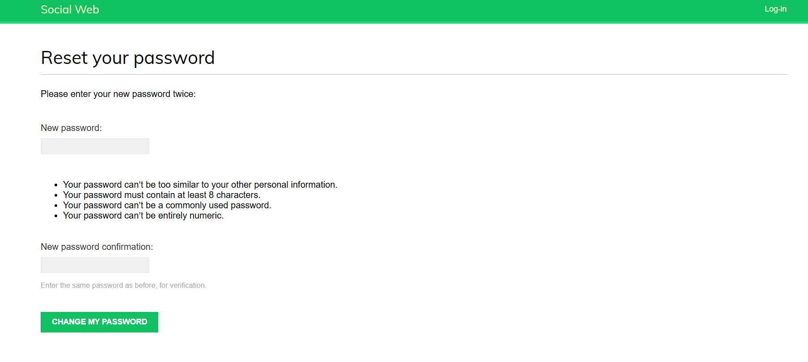
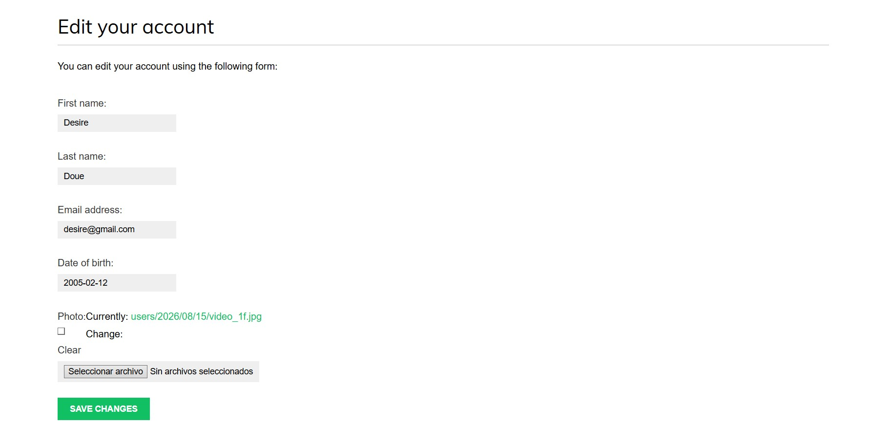
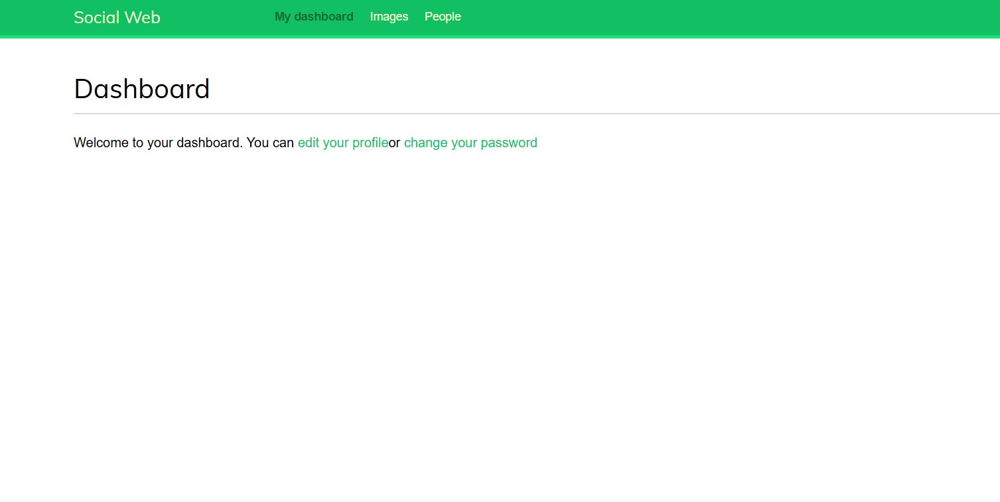
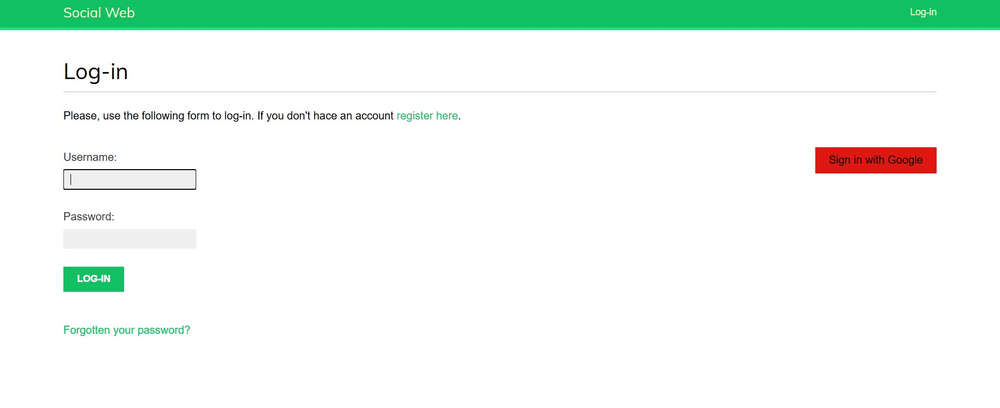
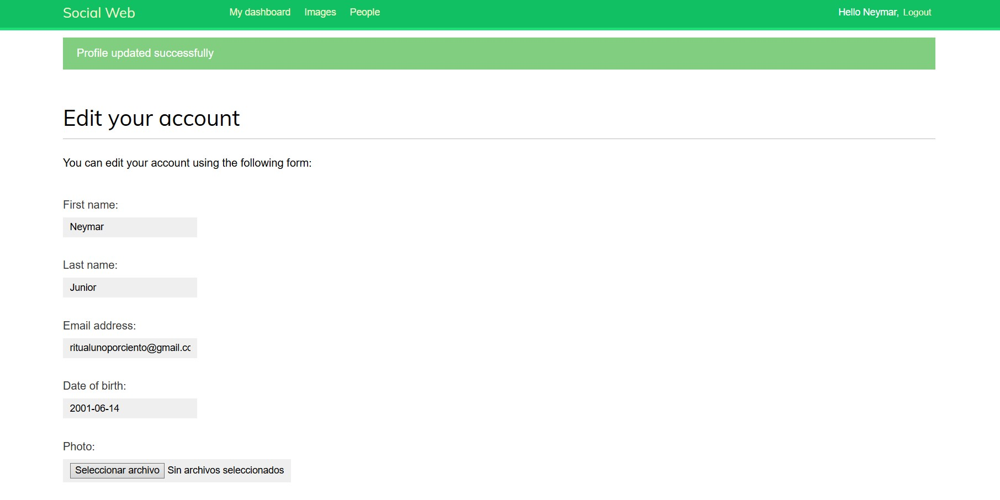
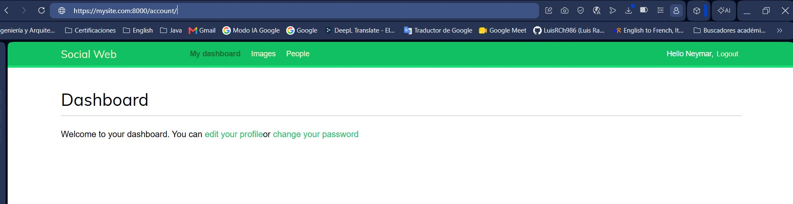

# SocialImage: Plataforma Red Social para Compartir Imágenes

SocialImage es una red social moderna centrada en la curación y el descubrimiento visual. La plataforma permite a los usuarios recopilar, organizar y compartir imágenes de cualquier lugar de internet, interactuar con otros creadores mediante un sistema de seguimiento dinámico y reaccionar al contenido en tiempo real.

---

## Roadmap General del Proyecto

El desarrollo de este ecosistema se ha planificado en fases incrementales:

- [✔️] **Fase 1: Sistema de Autenticación y Gestión de Perfiles** (En desarrollo)
- [✔️] **Fase 2:** Autenticación Social (OAuth2 con Google) e Integración Frontend.
- [ ] **Fase 3:** Motor de Marcadores (Bookmarklet) para capturar imágenes externas vía JavaScript.
- [ ] **Fase 4:** Flujo de Actividad Dinámico (Activity Stream) y Sistema de Seguimiento (Following).

---

## Fase 1: Sistema de Autenticación y Gestión de Perfiles

Esta primera fase establece las bases de seguridad, persistencia de usuarios y manejo de archivos multimedia del proyecto.

### Funcionalidades Implementadas
- **Autenticación Base:** Integración del marco nativo de autenticación de Django para la verificación segura de identidades (Login, Logout y Dashboard privado).
- **Seguridad de Cuentas:** Flujos completos y funcionales para el cambio de contraseñas de usuarios activos y el restablecimiento de credenciales olvidadas mediante la generación de tokens seguros basados en tiempo (`uidb64` / `token`) enviados por correo electrónico.
- **Perfiles Extendidos:** Ampliación del modelo `User` por defecto mediante una relación uno a uno (`OneToOneField`) con un modelo `Profile` personalizado para almacenar perfiles y datos adicionales.
- **Gestión de Identidad:** Implementación de formularios y vistas específicas para permitir a los usuarios editar la información de su perfil y actualizar sus credenciales desde el panel de control.

## Fase 2: Autenticación Social (Google OAuth2) e Integración de Servicios

Esta segunda fase expande las capacidades de acceso del ecosistema mediante la integración de proveedores externos de identidad, la optimización de flujos de validación y la securización del entorno local.

### Funcionalidades Implementadas
- **Autenticación Social (OAuth 2.0):** Integración con el proveedor de identidad de Google utilizando Python Social Auth, permitiendo un acceso rápido y seguro con un solo clic.
- **Pipeline de Registro Automatizado:** Personalización del flujo de autenticación social para interceptar la respuesta de Google y automatizar la instanciación del modelo `Profile` para cada nuevo usuario social.
- **Backend de Autenticación Dual:** Desarrollo de un backend personalizado a medida para flexibilizar el acceso local, habilitando el inicio de sesión mediante dirección de correo electrónico o nombre de usuario de forma indistinta.
- **Validación Temprana de Cuentas:** Implementación de restricciones a nivel de formulario para mitigar la colisión de datos, previniendo de forma proactiva el registro de correos electrónicos ya existentes en la base de datos.
- **Feedback en Tiempo Real:** Incorporación del framework de mensajes de Django para notificar dinámicamente al usuario el estado de sus acciones (alertas de éxito, errores o advertencias del sistema).

### Decisiones de Arquitectura
*   **Vistas de Autenticación:** Utilización de las herramientas nativas de Django para el manejo seguro de sesiones HTTP, previniendo vulnerabilidades comunes de autenticación mediante el uso de formularios protegidos con tokens CSRF.
---

## Capturas de Pantalla

|                               Interfaz de Login                               
|:-----------------------------------------------------------------------------:
|                                  
|                             Interfaz de Dashboard                             
|                                       |               
|                               Interfaz de Logot                               
|                                 |
|                      Interfaz de Reestablecer Contraseña                      
|                                  |
|              Interfaz de Formulario para Reestablecer Contraseña              
|                             |
|                   Interfaz de Formulario para Editar Perfil                   
|                                    |
| Interfaz de Dashboard con links hacia edición de perfil y cambio de contraseña 
|                                |
### Interfaces de Autenticación y Flujo Social

|              Control de Acceso y OAuth2               |                Mensajes de Feedback (UX)                |
|:-----------------------------------------------------:|:-------------------------------------------------------:|
|  |  |

### Entorno de Desarrollo Seguro

|                Servidor Local bajo HTTPS                |
|:-------------------------------------------------------:|
|  |


---

## Tecnologías y Herramientas
*   **Backend:** Python 3.14.0 +, Django 6.0.6
*   **Base de Datos:** SQLite (Desarrollo local preliminar)
*   **Estilos:** HTML5, CSS3

---

## Instalación y Configuración Local

### Prerrequisitos
*   Python 3.11 o superior instalado.
*   Gestor de entornos virtuales (venv).

### Pasos para Ejecutar
1. **Clonar el repositorio:**
   ```bash
   git clone https://github.com
   cd socialimage
   ```

2. **Crear y activar el entorno virtual:**
   ```bash
   python -m venv venv
   # En Windows:
   venv\Scripts\activate
   # En macOS/Linux:
   source venv/bin/activate
   ```

3. **Instalar dependencias:**
   ```bash
   pip install -r requirements.txt
   ```

4. **Ejecutar migraciones iniciales:**
   ```bash
   python manage.py migrate
   ```

5. **Iniciar el servidor de desarrollo:**
   ```bash
   python manage.py runserver
   ```
   Abre http://127.0.0.1:8000 en tu navegador.

---

## Bitácora de Desarrollo (Build Log)

Utilizo esta sección para documentar el progreso diario del proyecto.

### 08/07/2026 - Inicialización y Core de Autenticación
*   **Progreso:** Setup inicial de la arquitectura del proyecto en Django e implementación del flujo base de autenticación con la vista de Login.
*   **Tareas completadas:**
    *   Configuración del entorno virtual y dependencias base.
    *   Habilitación de la aplicación de autenticación en los ajustes de Django.
    *   Creación de la ruta y plantilla inicial para el formulario de inicio de sesión.

### 10/07/2026 - Control de Sesiones, Dashboard y Flujos de Contraseña
*   **Progreso:** Implementación completa del ciclo de autenticación base (Login/Logout), panel privado de usuario y maquetación inicial de los flujos de seguridad de credenciales.
*   **Tareas completadas:**
    *   Configuración de las vistas de inicio y cierre de sesión utilizando el sistema nativo de Django.
    *   Desarrollo de la vista y plantilla del Dashboard para usuarios autenticados.
    *   Ajustes en `settings.py` para definir las redirecciones automáticas globales (`LOGIN_REDIRECT_URL`, `LOGIN_URL` y `LOGOUT_URL`).
    *   Estructuración parcial de las plantillas para el cambio de contraseña y su respectiva confirmación de éxito.

### 12/07/2026 - Flujo Completo de Contraseñas y Optimizacion de Rutas
*   **Progreso:** Finalización del sistema de seguridad de cuentas mediante la implementación de las plantillas y rutas para el cambio y restablecimiento de contraseñas.
*   **Tareas completadas:**
    *   Diseño y maquetación de la suite completa de plantillas requeridas por el sistema de autenticación de Django (`password_change`, `password_reset`, `password_reset_email`, etc.).
    *   Mapeo inicial detallado de los seis endpoints individuales de seguridad en el archivo `urls.py`.
    *   Refactorización y optimización del enrutamiento centralizando los flujos bajo la directiva nativa `path('', include('django.contrib.auth.urls'))`.
*   **Decisión de Arquitectura:** Tras verificar el comportamiento individual de cada vista de autenticación, se optó por utilizar el enrutador unificado de Django. Esto reduce las líneas de código redundantes, mitiga errores de configuración manual en las expresiones de las URLs y garantiza la compatibilidad directa con los nombres de las plantillas estándar del framework.

### 15/08/2026 - Modelo de Perfil Personalizado e Interfaz de Edicion
*   **Progreso:** Culminación de la Fase 1 mediante la creación del modelo de datos para perfiles de usuario, desarrollo de la lógica de edición de cuentas y actualización de la navegación del Dashboard.
*   **Tareas completadas:**
    *   Definición del modelo `Profile` en la base de datos conectado al modelo `User` nativo.
    *   Desarrollo de formularios personalizados para la edición simultánea de los datos de usuario y perfil.
    *   Creación de la vista de edición y su correspondiente plantilla `edit.html`.
    *   Actualización del template del Dashboard para integrar dinámicamente los enlaces hacia los flujos de edición de perfil y cambio de contraseña.
   
### 15/08/2026 - Autenticación por Email, Google OAuth2 y Entorno Seguro HTTPS
*   **Progreso:** Implementación de un backend de autenticación personalizado, integración de inicio de sesión social con Google y securización del entorno de desarrollo local mediante certificados TLS.
*   **Tareas completadas:**
    *   Creación de un backend de autenticación a medida (`authentication.py`) para permitir el acceso mediante dirección de correo electrónico.
    *   Configuración del Framework de Mensajes de Django para proporcionar retroalimentación en tiempo real al actualizar perfiles.
    *   Implementación de validaciones robustas en formularios para mitigar la duplicidad de correos electrónicos en la base de datos.
    *   Integración de Python Social Auth y personalización de su pipeline para automatizar la creación del modelo `Profile` en registros OAuth2.
    *   Configuración de Django Extensions para ejecutar el servidor local bajo el protocolo seguro HTTPS empleando certificados SSL/TLS locales (`cert.crt`/`cert.key`).
